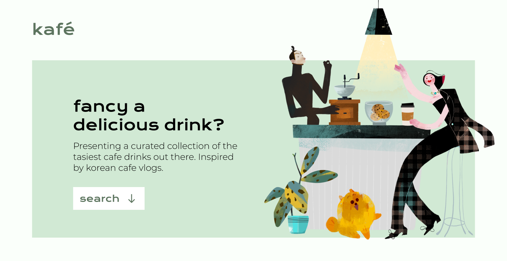

<!-- PROJECT LOGO -->
 

  

<h3 align="center">Kafe Drinks</h3>

  

    Wanna make a cool drink at home? Check out these tasty, trendy drink recipes.
  

<!-- ABOUT THE PROJECT -->

## About The Project

If you've seen any Korean Cafe Vlog or have visited Korea, you'll know that they make the best drinks! Many people in the comments of a Youtube video beg for recipes. So, it only made sense to make a repository of cafe drinks that you can make in the comfort of your own home.
 
 
This project is currently under construction. A demo will be coming out very shortly!

### Built With

- [React.js](https://reactjs.org/)
- [MongdoDB](https://www.mongodb.com/)
